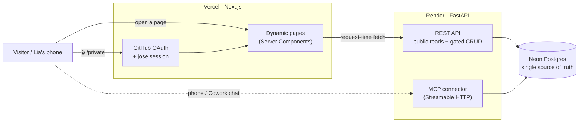

# lia-til · Today I Learn

A public **learning-progress site** for a software-engineering job search — open the URL and
see what Lia is studying, day by day, no login required. Behind the simple public face is a
full cloud stack: a **Next.js** frontend, a **FastAPI** backend, and **Postgres** as the single
source of truth — so the site updates live from anywhere (including a phone) with no rebuild.

🔗 **Live:** [lia-til.vercel.app](https://lia-til.vercel.app) · **API:** [lia-til.onrender.com](https://lia-til.onrender.com) · **Repo:** [patelinadev/lia-til](https://github.com/patelinadev/lia-til)

> Built incrementally as a learning exercise. The full step-by-step dev + deploy history for
> every phase/stage lives in [`docs/walkthrough.html`](docs/walkthrough.html).

## What's on the site

| Section | Public sees | Private (GitHub-gated) |
|---|---|---|
| **Daily Log** | a curated one-line summary + LeetCode chips per day | the full per-day record (Tech / Interview / Oral English / … sections) |
| **LeetCode** | solved problems on the [0x3f 基础算法精讲](https://space.bilibili.com/206214/channel/collectiondetail?sid=842776) track — filter, sort, colored topics, 5-state status | — |
| **Applications** | anonymized dashboard (counts only) + submissions calendar | the full ledger (fuzzy search + filters) |
| **System Design** | study notes, one page per deck, with re-drawn theme-aware diagrams | — |

A discreet 🔒 in the corner opens the private area (GitHub OAuth). Public endpoints only ever
expose **aggregates and curated fields** — no company names, roles, salaries, or private notes.

## Architecture



**Data model:** Postgres is the single source of truth. Pages are `force-dynamic` — they fetch
the API **at request time**, so any edit is live on the next page load with *no redeploy*.
Content is written three ways, all hitting the same gated CRUD API: from a laptop (skills),
from the browser (private area), and **from a phone** via a custom MCP connector.

## Tech stack

| Layer | Choice | Notes |
|---|---|---|
| Frontend | Next.js 16 · React 19 · TypeScript · Tailwind v4 | App Router, Server Components, dynamic (request-time) rendering, theme-aware |
| Hosting (web) | Vercel | push to `main` → auto-deploy |
| Backend | FastAPI · SQLAlchemy (Python 3.12) | public read endpoints + secret-gated CRUD |
| Hosting (API) | Render | `uvicorn`, kept warm by a 5-min `/health` cron |
| Database | Neon Postgres | serverless; scale-to-zero |
| Auth | Custom GitHub OAuth + `jose` JWT session | gates the private full-data views |
| Phone access | Model Context Protocol connector (`fastmcp`) | daily-log CRUD from a phone chat as MCP tools |

## Security & safety nets

- **Two-tier secrets:** a master `BACKEND_SECRET` for full CRUD, plus a **scoped**
  `DAILYLOG_SECRET` that unlocks *only* the daily-log + index routes — the token a phone/cloud
  session carries has a blast radius of just the daily log.
- **Append-only shadow backup:** every scoped-key write is snapshotted to a `shadow_history`
  table the scoped key can't read or alter; a master-only `/restore` recovers from any bad
  write or delete.
- **Privacy by construction:** public serializers never emit private fields; the anonymized
  Applications data is derived server-side, and the raw ledger stays in a git-ignored file.

## Structure

```
web/                         # Next.js app (Vercel root directory)
├── app/
│   ├── page.tsx             # minimal home hub
│   ├── layout.tsx           # shell + discreet 🔒 private entry
│   ├── daily-log/           # public curated timeline
│   ├── leetcode/            # filter/sort/status problem table
│   ├── applications/        # anonymized dashboard + calendar
│   ├── system-design/[slug] # per-deck notes + re-drawn diagrams
│   ├── private/             # GitHub-gated full views
│   ├── api/auth/            # OAuth login / callback / logout
│   └── components/          # SectionBody (markdown renderer), explorers, …
└── lib/
    ├── net.ts               # retry-until-awake fetch (rides out Render cold starts)
    ├── private.ts           # secret-gated backend fetches (server-only)
    ├── auth.ts / session.ts # GitHub OAuth + jose session
    └── stats.ts / daily.ts  # helpers

backend/                     # FastAPI app (Render root directory)
├── main.py                  # endpoints + gated CRUD + shadow backup + MCP server
├── models.py                # SQLAlchemy models (Neon)
└── db.py                    # engine / session

docs/walkthrough.html        # living dev + deploy walkthrough, one section per phase/stage
```

## Roadmap

- **Phase 1 — frontend + deploy pipeline** ✅ · Next.js skeleton on Vercel with Git-push auto-deploy; the four public sections.
- **Phase 2 — cloud backend** ✅ · FastAPI (Render) + Neon Postgres as the single source of truth; instant sync (dynamic pages); GitHub-gated private views; cloud-only CRUD; résumé integration; a **phone MCP connector**; then consolidated to a single **Vercel + Render** deploy surface (the legacy static GitHub Pages frontend and the Node v1 backend leftovers retired; one Vercel `Production` environment). _(In progress: a public `study-notes` knowledge base.)_
- **Phase 3 — DevOps** · Docker + GitHub Actions CI/CD + AWS.

## Local development

```bash
# frontend
cd web && npm install && npm run dev        # http://localhost:3000  (set API_URL to the backend)

# backend
cd backend && python -m venv .venv && source .venv/bin/activate
pip install -r requirements.txt
DATABASE_URL='postgresql://…neon.tech/neondb?sslmode=require' uvicorn main:app --reload
```

See [`web/.env.example`](web/.env.example) and [`backend/.env.example`](backend/.env.example) for the
environment variables (`API_URL`, `BACKEND_SECRET`, the GitHub-OAuth vars, `DATABASE_URL`, …).
